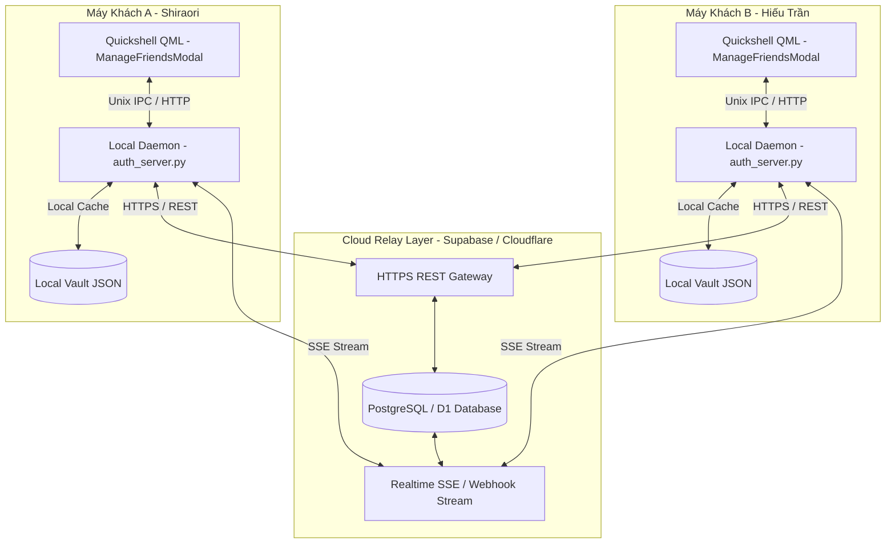

# Thiết Kế Kỹ Thuật: Hệ Thống Kết Bạn Toàn Cầu & Cloud Relay (Nutsty Global Friends & PIN Discovery)

Tài liệu thiết kế kiến trúc cho hệ thống kết bạn toàn cầu trên Nutsty, cho phép người dùng ở bất kỳ đâu trên thế giới kết bạn qua Mã PIN 6 số hoặc Nutsty Tag, đồng bộ sự kiện thời gian thực và tự động tạo avatar chữ cái chuẩn Google Material.

---

## 1. Bối Cảnh & Mục Tiêu

### 1.1. Hiện trạng
- Hệ thống bạn bè và sự kiện hiện tại đang phụ thuộc vào daemon cục bộ (`127.0.0.1:17890`) và các tệp JSON vault (`~/.config/noctalia/nutsty_*_vault.json`).
- Chỉ có thể kết bạn và tương tác giữa các profile trên cùng một máy tính hoặc mạng nội bộ.
- Tìm kiếm email người lạ không có avatar Google do Gmail không cung cấp Public API vì lý do bảo mật cá nhân, dẫn đến avatar bị fallback thành icon cờ lê hệ thống.

### 1.2. Mục tiêu thiết kế
1. **Kết bạn xuyên Internet (Global Connectivity)**: Hai người dùng ở bất kỳ đâu trên thế giới (khác mạng WiFi, 4G, sau Router NAT/Firewall) đều có thể tìm thấy nhau và kết bạn tức thì.
2. **Định danh bằng Mã PIN 6 số & Nutsty Tag**:
   - Mỗi người dùng có một **Mã PIN 6 số** (ví dụ: `842 109`) và một **Nutsty Tag** (ví dụ: `Shiraori#6180`).
   - Người dùng chỉ cần đọc mã PIN hoặc gửi Tag cho bạn bè là tìm thấy nhau 100% chính xác, không cần chia sẻ email cá nhân nếu muốn bảo mật danh tính.
3. **Đồng bộ thời gian thực hai chiều (Real-time Dual Sync)**:
   - Gửi lời mời, chấp nhận, từ chối, hủy kết bạn cập nhật 0ms trên cả 2 màn hình.
   - Hỗ trợ lưu trữ tin nhắn ngoại tuyến (Offline Store & Forward): khi bạn bè tắt máy, khi họ mở lại Nutsty vẫn nhận đầy đủ lời mời.
4. **Google Material Initials Avatar Engine**:
   - Tự động sinh avatar tròn với bảng màu Google Material (Blue `#1a73e8`, Emerald `#1e8e3e`, Tangerine `#e37400`, Violet `#8430ce`...) cùng chữ cái đầu in hoa màu trắng nổi bật cho mọi tài khoản chưa có ảnh đại diện, xóa sổ hoàn toàn icon cờ lê.
5. **Kiến trúc Hybrid Cloud-Local (Zero Interruption)**:
   - Khi có kết nối mạng: Đồng bộ qua Cloud Relay siêu nhẹ (Supabase / Cloudflare REST + Realtime SSE).
   - Khi mất mạng: Tự động fallback dùng local cache trên máy mà không gây gián đoạn trải nghiệm người dùng.

---

## 2. Kiến Trúc Hệ Thống (System Architecture)

---

## 3. Lược Đồ Dữ Liệu Cloud Relay (Database Schema)

### 3.1. Bảng `nutsty_profiles`
Lưu trữ thông tin định danh công khai của người dùng:
- `id`: UUID (Khóa chính).
- `nutsty_tag`: Text (Unique, định dạng `Username#1234`, ví dụ `Shiraori#6180`).
- `pin_code`: Varchar(6) (Unique, mã 6 số ngẫu nhiên, ví dụ `842109`). Có thể đổi mã mới (Regenerate).
- `email`: Text (Địa chỉ email tài khoản Google, có thể ẩn hoặc công khai).
- `display_name`: Text (Tên hiển thị, ví dụ `Shiraori`, `Hiếu Trần`).
- `avatar_url`: Text (Link ảnh Google đại diện thật hoặc rỗng để client tự render Google Initials).
- `now_playing`: JSONB (Bài hát đang nghe gần nhất).
- `last_seen`: Timestamp (Thời điểm hoạt động gần nhất).

### 3.2. Bảng `nutsty_friendships`
Quản lý quan hệ bạn bè 2 chiều:
- `id`: UUID (Khóa chính).
- `user_id_1`: UUID (Tham chiếu `nutsty_profiles.id`).
- `user_id_2`: UUID (Tham chiếu `nutsty_profiles.id`).
- `status`: Enum (`pending`, `accepted`, `blocked`).
- `initiated_by`: UUID (Người gửi lời mời).
- `created_at`: Timestamp.
- `updated_at`: Timestamp.

### 3.3. Bảng `nutsty_events`
Hàng đợi sự kiện thời gian thực (Realtime Event Queue):
- `id`: UUID (Khóa chính).
- `recipient_id`: UUID (Người nhận sự kiện).
- `sender_id`: UUID (Người phát sự kiện).
- `event_type`: Enum (`friend_request`, `friend_accepted`, `friend_removed`, `track_suggest`, `chat_bubble`).
- `payload`: JSONB (Nội dung chi tiết của sự kiện).
- `consumed`: Boolean (Đã nhận hay chưa).
- `created_at`: Timestamp.

---

## 4. Giao Diện Người Dùng (UI/UX Design)

### 4.1. Thẻ Định Danh Cá Nhân (My Nutsty Tag & PIN Card)
Đặt ngay đầu modal `ManageFriendsModal.qml`:
- Nền phẳng Dark Glass (không hộp lồng hộp).
- Avatar cá nhân tròn phẳng kèm viền chỉ mỏng theo `accentColor`.
- Tên người dùng và **Nutsty Tag** (ví dụ: `Shiraori#6180`).
- **Mã PIN 6 số** nổi bật: `842 109` kèm nút **[ Sao chép ]** (Copy to clipboard và hiển thị tooltip "Đã sao chép!").
- Nút **[ ↻ Đổi mã ]** nếu muốn tạo mã PIN mới chống làm phiền.

### 4.2. Thanh Tìm Kiếm Đa Năng (Universal Search Bar)
- Placeholder: `I18n.tr("Nhập mã PIN 6 số, Nutsty Tag hoặc email...", "Enter 6-digit PIN, Nutsty Tag or email...")`.
- Tự động nhận diện kiểu nhập liệu:
  - Nếu là 6 chữ số: Tìm kiếm theo mã PIN toàn cầu.
  - Nếu có chứa dấu `#`: Tìm kiếm theo Nutsty Tag chính xác.
  - Nếu có chứa dấu `@`: Tìm kiếm theo Email.
  - Tự do: Tìm kiếm theo tên hiển thị.

### 4.3. Google Material Initials Avatar Engine
- Triển khai trực tiếp trong `components/RoundedImage.qml`:
  - Khi `source === ""` hoặc tải ảnh lỗi:
  - Lấy chữ cái đầu tiên của tên hoặc email (viết hoa, ví dụ: "Hiếu Trần" -> **H**).
  - Thuật toán băm chuỗi (String Hash) sang một trong các màu chuẩn Google Material:
    - Google Blue: `#1a73e8`
    - Google Emerald: `#1e8e3e`
    - Google Tangerine: `#e37400`
    - Google Violet: `#8430ce`
    - Google Raspberry: `#d93025`
    - Google Cyan: `#0097a7`
  - Vẽ chữ cái màu trắng tinh với độ dày bán đậm (SemiBold), căn giữa hoàn hảo.
  - **Loại bỏ 100% icon cờ lê mặc định**.

---

## 5. Quy Trình Đồng Bộ & Xử Lý Sự Kiện (Data Flow)

1. A nhập mã PIN 6 số của B (ví dụ `842109`) vào thanh tìm kiếm.
2. Client A gọi `GET /api/friends/search?q=842109`.
3. Cloud Relay tra cứu bảng `nutsty_profiles` và trả về thông tin B: `{ id, name: "Hiếu Trần", tag: "Hieu#2607", avatar: "..." }`.
4. A bấm `[ + Kết bạn ]` -> Cloud Relay ghi nhận vào `nutsty_friendships` và bắn sự kiện `friend_request` qua SSE đến Client B.
5. Client B nhận sự kiện tức thì -> Toast báo `"Shiraori đã gửi lời mời kết bạn"`, badge chuông hiện số `1`.
6. B bấm `[ Đồng ý ]` -> Cloud Relay chuyển trạng thái sang `accepted` và bắn sự kiện `friend_accepted` về Client A.
7. Cả hai Client A và B tự động nạp avatar của nhau lên thanh bạn bè `FriendsPulseBar` thời gian thực.
