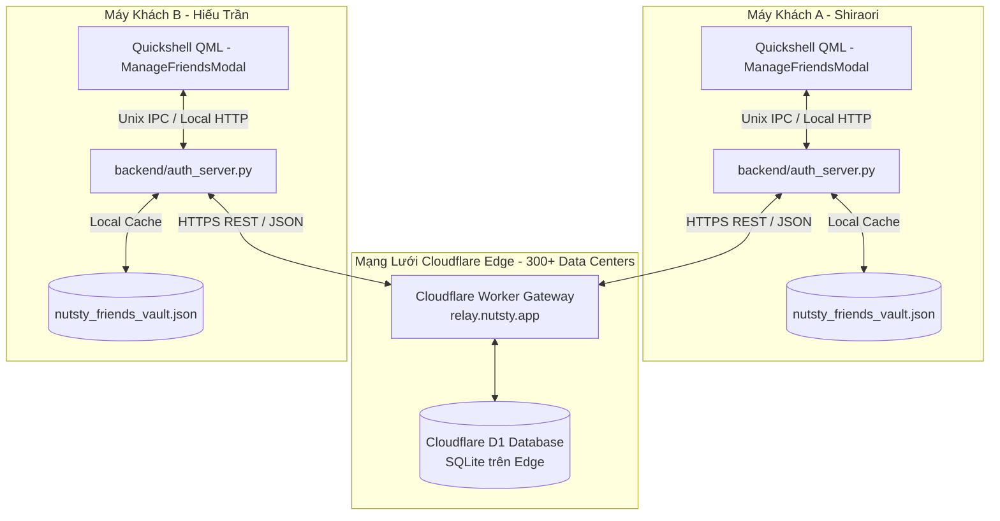

# Thiết Kế Kỹ Thuật: Hệ Thống Kết Bạn Toàn Cầu Cloudflare D1 & Discord-style Tag (Nutsty Global Friends Relay)

Tài liệu đặc tả kiến trúc hệ thống kết bạn toàn cầu cho Nutsty Music Player, sử dụng công nghệ **Cloudflare Workers (Edge Computing)** và **Cloudflare D1 (Serverless SQLite)**, định danh cá nhân theo phong cách Discord Tag (`Username#1234`), và liên kết bạn bè bằng **Immutable User UUID** đảm bảo đổi tên 100% không mất bạn bè.

---

## 1. Bối Cảnh & Mục Tiêu

### 1.1. Hiện trạng
- Hệ thống bạn bè hiện tại chỉ hoạt động trên mạng nội bộ hoặc cùng 1 máy tính qua daemon local `127.0.0.1:17890`.
- Hai người dùng ở hai mạng WiFi khác nhau, dùng 4G hoặc ở các quốc gia khác nhau không thể kết nối trực tiếp do rào cản NAT/Firewall.
- Mã PIN 6 số đứng độc lập thiếu tính cá nhân hóa và khó nhớ.

### 1.2. Mục tiêu kỹ thuật
1. **Kết bạn xuyên Internet toàn cầu (Global Connectivity)**:
   - Hai người dùng ở bất kỳ đâu trên thế giới đều có thể tìm thấy nhau và kết bạn tức thì thông qua mạng lưới máy chủ Edge của Cloudflare.
2. **Định danh Discord Tag (`Username#1234`)**:
   - Cho phép trùng tên hiển thị (nhiều người cùng tên `Shiraori` hoặc `Hiếu Trần`).
   - Phân biệt bằng số định danh 4 chữ số (ví dụ: `Shiraori#6180`, `HieuTran#2607`).
   - Người dùng có thể **đổi tên hiển thị** và **đổi số Tag** bất cứ lúc nào.
3. **Immutable User UUID (Đổi tên không mất bạn bè)**:
   - Mỗi người dùng được cấp một UUID cố định vĩnh viễn (`usr_xxxxxxxx`).
   - Mối quan hệ bạn bè trong cơ sở dữ liệu liên kết theo UUID, không liên kết theo chuỗi tên. Khi bạn A đổi tên, danh sách bạn bè của bạn B tự động cập nhật tên mới mà không bị đứt kết nối.
4. **Zero Self-Hosting & Zero-Cost**:
   - Sử dụng Cloudflare Workers (100.000 req/ngày miễn phí) và Cloudflare D1 (5.000.000 lượt đọc/tháng miễn phí).
   - Không cần mua VPS, không cần cài đặt Linux server hay bảo trì phần cứng.
5. **Hybrid Fallback (Offline-First)**:
   - Khi mất mạng: Nutsty tự động dùng bộ nhớ cache cục bộ, không gián đoạn việc phát nhạc. Khi có mạng trở lại: tự động đồng bộ tiếp.

---

## 2. Kiến Trúc Hệ Thống (System Architecture)



---

## 3. Lược Đồ Cơ Sở Dữ Liệu Cloudflare D1 (SQL Schema)

### 3.1. Bảng `nutsty_users`
Quản lý hồ sơ định danh người dùng:
```sql
CREATE TABLE IF NOT EXISTS nutsty_users (
    id TEXT PRIMARY KEY,               -- UUID v4 vĩnh viễn (ví dụ: usr_89a1c2...)
    secret_key TEXT NOT NULL,          -- Khóa bí mật của client để xác thực khi đổi tên/tag
    username TEXT NOT NULL,            -- Tên hiển thị (ví dụ: "Shiraori", "Hiếu Trần")
    discriminator TEXT NOT NULL,       -- 4 chữ số (ví dụ: "6180", "2607")
    tag TEXT NOT NULL UNIQUE,          -- Định dạng chuẩn: username#discriminator (ví dụ: "Shiraori#6180")
    avatar_url TEXT DEFAULT '',        -- URL ảnh đại diện Google (nếu rỗng thì client tự render Google Initials)
    now_playing TEXT DEFAULT '',       -- JSON chuỗi bài hát đang nghe
    created_at INTEGER NOT NULL,       -- Epoch timestamp (ms)
    updated_at INTEGER NOT NULL,       -- Epoch timestamp (ms)
    last_active_at INTEGER NOT NULL    -- Epoch timestamp (ms)
);

CREATE INDEX IF NOT EXISTS idx_users_tag ON nutsty_users(tag);
CREATE INDEX IF NOT EXISTS idx_users_username ON nutsty_users(username);
```

### 3.2. Bảng `nutsty_friendships`
Quản lý mối quan hệ bạn bè 2 chiều theo UUID:
```sql
CREATE TABLE IF NOT EXISTS nutsty_friendships (
    id TEXT PRIMARY KEY,               -- UUID v4 của mối quan hệ
    user_id_1 TEXT NOT NULL,           -- UUID người dùng 1 (luôn là min(user_a, user_b) để tránh trùng lặp)
    user_id_2 TEXT NOT NULL,           -- UUID người dùng 2 (luôn là max(user_a, user_b))
    status TEXT NOT NULL,              -- 'pending', 'accepted', 'rejected'
    initiated_by TEXT NOT NULL,        -- UUID người gửi lời mời
    created_at INTEGER NOT NULL,
    updated_at INTEGER NOT NULL,
    FOREIGN KEY(user_id_1) REFERENCES nutsty_users(id),
    FOREIGN KEY(user_id_2) REFERENCES nutsty_users(id),
    UNIQUE(user_id_1, user_id_2)
);

CREATE INDEX IF NOT EXISTS idx_friendships_u1 ON nutsty_friendships(user_id_1);
CREATE INDEX IF NOT EXISTS idx_friendships_u2 ON nutsty_friendships(user_id_2);
```

### 3.3. Bảng `nutsty_events`
Hàng đợi sự kiện thời gian thực (Realtime Event Queue):
```sql
CREATE TABLE IF NOT EXISTS nutsty_events (
    id TEXT PRIMARY KEY,
    to_user_id TEXT NOT NULL,          -- UUID người nhận
    from_user_id TEXT NOT NULL,        -- UUID người gửi
    event_type TEXT NOT NULL,          -- 'friend_request', 'friend_accepted', 'friend_removed'
    payload TEXT NOT NULL,             -- JSON string chi tiết
    consumed INTEGER DEFAULT 0,        -- 0: chưa nhận, 1: đã nhận
    created_at INTEGER NOT NULL
);

CREATE INDEX IF NOT EXISTS idx_events_to_user ON nutsty_events(to_user_id, consumed);
```

---

## 4. Đặc Tả REST API của Cloudflare Worker

Tất cả API giao tiếp qua giao thức chuẩn HTTPS JSON:

1. **`POST /api/users/register`**:
   - Request: `{ "username": "Shiraori", "avatar_url": "...", "client_secret": "..." }`
   - Logic: Nếu client đã có `client_secret`, nạp lại profile cũ. Nếu chưa có, sinh UUID mới và sinh 4 số tag `#NNNN` không trùng lặp.
   - Response: `{ "success": true, "user": { "id": "...", "username": "...", "discriminator": "...", "tag": "Shiraori#6180", "avatar_url": "..." }, "secret_key": "..." }`

2. **`POST /api/users/update_profile`**:
   - Request: `{ "user_id": "...", "secret_key": "...", "new_username": "Lucy", "new_discriminator": "9999" }`
   - Logic: Kiểm tra `secret_key`. Kiểm tra xem `Lucy#9999` đã có ai dùng chưa. Nếu đã có người dùng, tự động trả về lỗi kèm gợi ý số khả dụng (`Lucy#9998`).
   - Response: `{ "success": true, "user": { ... } }`

3. **`GET /api/users/search?q=Shiraori%236180`**:
   - Query: `q` có thể là tag chính xác (`Shiraori#6180`), tên (`Shiraori`), hoặc số tag (`#6180`).
   - Response: `{ "results": [ { "id": "...", "username": "Shiraori", "tag": "Shiraori#6180", "avatar_url": "..." } ] }`

4. **`POST /api/friends/request`**:
   - Request: `{ "from_user_id": "...", "secret_key": "...", "target_user_id": "..." }`
   - Logic: Tạo bản ghi trong `nutsty_friendships` (status: `pending`) và tạo sự kiện `friend_request` trong `nutsty_events`.
   - Response: `{ "success": true, "message": "Đã gửi lời mời" }`

5. **`POST /api/friends/respond`**:
   - Request: `{ "user_id": "...", "secret_key": "...", "request_id": "...", "action": "accept" | "reject" }`
   - Logic: Cập nhật `nutsty_friendships` sang `accepted` và tạo sự kiện `friend_accepted` gửi cho người kia.
   - Response: `{ "success": true }`

6. **`POST /api/friends/remove`**:
   - Request: `{ "user_id": "...", "secret_key": "...", "target_user_id": "..." }`
   - Logic: Xóa quan hệ khỏi `nutsty_friendships` và bắn sự kiện `friend_removed` cho cả 2 bên.
   - Response: `{ "success": true }`

7. **`GET /api/friends?user_id=...`**:
   - Lấy danh bạ bạn bè hiện tại kèm trạng thái của họ (tên mới nhất, avatar, bài hát đang nghe).

8. **`GET /api/events?user_id=...&secret_key=...`**:
   - Lấy danh sách sự kiện mới gửi đến người dùng này và đánh dấu `consumed = 1`.

---

## 5. Thiết Kế Giao Diện Quản Lý Bạn Bè Mới (`ManageFriendsModal.qml`)

1. **Thẻ Định Danh Cá Nhân (Personal Tag Card)**:
   - Nền phẳng Dark Glass mờ sang trọng.
   - Avatar tròn Google Material.
   - Tên to: **Shiraori** kèm Tag màu tím **#6180**.
   - Nút **[ 📋 Sao chép Tag ]**: bấm 1-chạm sao chép `Shiraori#6180` vào clipboard kèm tooltip xanh `"Đã chép!"`.
   - Nút **[ ✎ Đổi tên & Tag ]**: mở giao diện chỉnh sửa:
     - Ô nhập tên mới.
     - Ô nhập số Tag hoặc nút [ 🎲 Ngẫu nhiên ] tự sinh 4 số đẹp.
     - Nút [ Lưu thay đổi ] gửi lên Cloudflare Worker.
2. **Thanh Tìm Kiếm Đa Năng**:
   - Placeholder: `I18n.tr("Nhập Nutsty Tag (ví dụ: Shiraori#6180) hoặc tên...", "Enter Nutsty Tag (e.g. Shiraori#6180) or name...")`.
   - Tìm kiếm nhanh, hiển thị avatar Google Material kèm nút `[ + Kết bạn ]`.
3. **Danh Sách Bạn Bè Phẳng (Flat Friends List)**:
   - Hiển thị tên bạn bè, tag `#NNNN`, bài hát họ đang nghe và nút `[ 🗑 Hủy kết bạn ]` màu Muted Rose.

---

## 6. Lợi Ích Cốt Lõi So Với Cách Cũ
- **Không hardcode**: Không còn bất kỳ dòng code nào chứa email cá nhân hay dữ liệu giả lập.
- **Toàn cầu**: Bạn bè ở bất kỳ quốc gia nào chỉ cần cài Nutsty là kết bạn được ngay qua Tag.
- **Bảo mật**: Không ai phải để lộ email cá nhân, chỉ cần trao đổi Tag công khai.
- **Bền bỉ**: Đổi tên thoải mái không bao giờ lo mất danh sách bạn bè.
